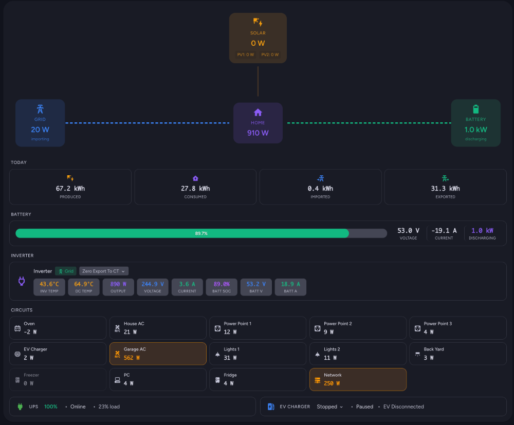

# Energy Flow Card

[](https://github.com/hacs/integration)
[](https://github.com/bradmatt275/ha-energy-card/releases)

A custom Home Assistant Lovelace card that displays real-time energy flow through your solar/battery system with animated flow visualization.



## Features

- 🔄 **Real-time Flow Visualization** - Animated flow lines showing power direction and magnitude
- ☀️ **Solar Support** - Multiple PV array support with individual power display
- 🔋 **Battery Integration** - SOC bar with voltage, current, and power stats
- ⚡ **Grid Monitoring** - Import/export status with daily totals
- 🏠 **Home Consumption** - Calculated or sensor-based home power
- 📊 **Daily Totals** - Production, consumption, import, export, and self-sufficiency
- 🔌 **Circuit Monitoring** - Grid of individual circuits with top consumer highlighting
- 🔋 **UPS Status** - Battery level, status, and load percentage
- 🚗 **EV Charger Control** - Status display with interactive charge mode selection
- 👆 **Click-to-Details** - Tap any entity to open its Home Assistant details dialog
- 📱 **Responsive Design** - Adapts layout for mobile and tablet displays
- 🎨 **Visual Config Editor** - Full GUI configuration without YAML editing
- 🎯 **Material You Styling** - Modern design that matches Home Assistant themes

## Installation

### HACS (Recommended)

[](https://my.home-assistant.io/redirect/hacs_repository/?owner=bradmatt275&repository=ha-energy-card&category=integration)

1. Open HACS in your Home Assistant instance
2. Go to "Frontend" section
3. Click the three dots menu and select "Custom repositories"
4. Add this repository URL and select "Lovelace" as the category
5. Search for "Energy Flow Card" and install it
6. Refresh your browser

### Manual Installation

1. Download `energy-flow-card.js` from the [latest release](https://github.com/bradmatt275/ha-energy-card/releases)
2. Copy it to your `config/www` folder
3. Add the resource in Home Assistant:
   - Go to Settings → Dashboards → Resources
   - Add `/local/energy-flow-card.js` as JavaScript Module

## Quick Start

1. Add a new card to your dashboard
2. Search for "Energy Flow Card"
3. Use the visual editor to configure your entities

Or use YAML:
```yaml
type: custom:energy-flow-card
title: "Energy Flow"

solar:
  show: true
  arrays:
    - name: "PV1"
      power: sensor.pv1_power
    - name: "PV2"
      power: sensor.pv2_power
  daily_production: sensor.solar_daily_production

grid:
  show: true
  power: sensor.grid_power
  daily_import: sensor.grid_daily_import
  daily_export: sensor.grid_daily_export

battery:
  show: true
  power: sensor.battery_power
  soc: sensor.battery_soc
  voltage: sensor.battery_voltage
  current: sensor.battery_current
  daily_charge: sensor.battery_daily_charge      # Optional
  daily_discharge: sensor.battery_daily_discharge # Optional

circuits:
  show: true
  columns: 4
  items:
    - name: "AC"
      icon: "mdi:air-conditioner"
      power: sensor.ac_power
    - name: "Fridge"
      icon: "mdi:fridge"
      power: sensor.fridge_power
```

## Documentation

📖 **[Full Documentation](docs/README.md)** - Complete configuration reference, all options, and troubleshooting guide.

## Power Sign Conventions

| Source   | Positive Value     | Negative Value      |
|----------|-------------------|---------------------|
| Solar    | Production        | N/A (always +)      |
| Battery  | Charging          | Discharging         |
| Grid     | Importing         | Exporting           |

## Styling

The card uses CSS custom properties that integrate with Home Assistant themes:

| Element | Color | CSS Variable |
|---------|-------|--------------|
| Solar | Amber | `--energy-solar: #F59E0B` |
| Grid | Blue | `--energy-grid: #3B82F6` |
| Battery | Emerald | `--energy-battery: #10B981` |
| Home | Violet | `--energy-home: #8B5CF6` |

## Development

```bash
npm install    # Install dependencies
npm run build  # Production build
npm run watch  # Development with watch
```

## License

MIT License - See [LICENSE](LICENSE) for details.

MIT License - see [LICENSE](LICENSE) for details.
